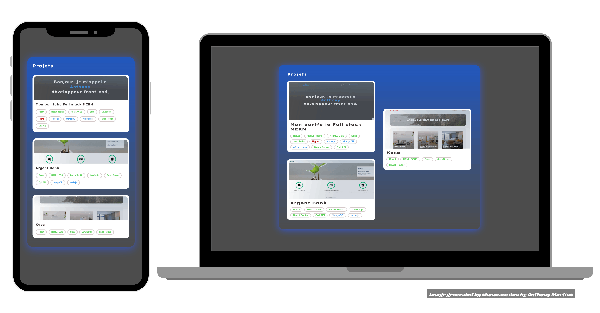
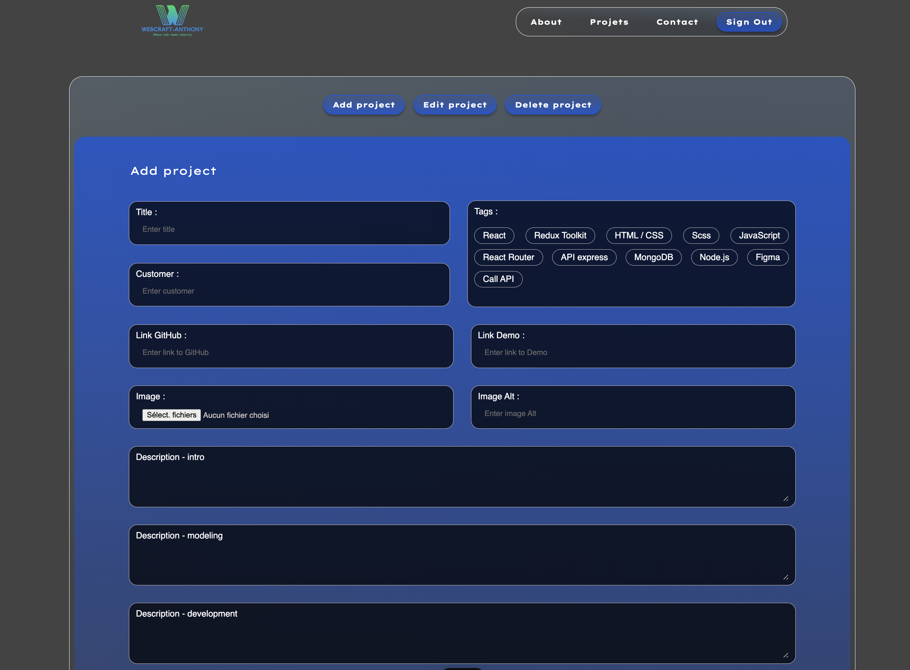

# portfolio

## Aperçu du projet

## Description du projet

Ce projet a été réalisé dans le cadre de ma formation d'intégrateur web chez [OpenClassrooms](https://openclassrooms.com/fr/). 

Il s'agit de mon portfolio en ligne, conçu pour présenter mes compétences, mon parcours professionnel et mes projets en tant que développeur. 

Le portfolio inclut plusieurs projets, chacun accompagné de descriptions détaillées, de compétences mises en oeuvre et de liens vers le code source ou les versions déployées. 

Les fonctionnalités dynamiques, tells que le formulaire de contact et la gestion des projets, sont gérées par un backend personnalisé. 

- **Frontend :** 
- **Backend :** 

## La section admin

La section admin permet une gestion complète des projets, incluant les fonctionnalités suivantes :

- Ajout de nouveau projets
- Modification des projets existants
- Suppression des projets
- Interface sécurisée, accessible uniquement aux administrateurs

## Site en ligne

[Visitez le portfolio ici](https://portfolio-anthonys-projects-7df4ba6d.vercel.app)

## Objectifs

- **Créer un site web personnel** : Développer un portfolio qui présente mes compétences et mon parcours en tant que développeur.
- **Développer un projet full-stack** : Utiliser un frontend moderne (React) et un backend personnalisé (Node.js + Express) pour des fonctionnalités dynamiques.
- **Déployer le site sur des services d'hébergement modernes** : Utiliser Vercel pour le frontend et Render pour le backend, offrant une infrastructure robuste et scalable.
- **Assurer une compatibilité cross-device** : Un design responsive est implémenté pour garantir une expérience utilisateur optimale sur tous les appareils (desktop, tablette, mobile).
- **Optimiser la performance et le SEO** : Le site est optimisé pour une performance maximale et un bon référencement sur les moteurs de recherche.
- **Intégrer des fonctionnalités de sécurité** : Un formulaire de contact sécurisé avec reCAPTCHA pour éviter les soumissions indésirables.
- **Développer une section admin** : Une interface dédiée permet de gérer facilement les projets, avec des fonctionnalités d'ajout, de modification et de suppression.

## Fonctionnalités

- **Interface responsive** : Adaptation automatique à tous les types d'écrans pour une expérience utilisateur fluide.
- **Gestion de projets** : Ajout, modification et suppression de projets via une API Node.js avec une interface admin.
- **Formulaire de contact sécurisé** :  Un formulaire de contact protégé par reCAPTCHA pour prévenir les spams.
- **Section admin** : Une interface permettant une gestion complète des projets.
- **Performance optimisée** : Des technologies modernes pour garantir à la fois la sécurité et la rapidité du site.
- **SEO** : Optimisation pour un meilleur positionnement dans les moteurs de recherche.

## Résultats attendus

- **Portfolio en ligne** : Un site accessible publiquement, présentant mes compétences et mes projets.
- **Formulaire sécurisé** : Un formulaire de contact protégé contre les soumissions de spam.
- **Gestion facile des projets** : Un tableau de bord admin complet pour la gestion des projets.
- **Performance optimale** : Un site rapide et bien référencé, accessible sur tous les appareils.

## Technologies utilisés

- **Frontend** :  
  
  
  
  
  

- **Backend** :  
  
  
  

- **Sécurité** :  
  

- **Hébergement** :  
  
  

- **Outils de design** :  
  

## Auteur

  
